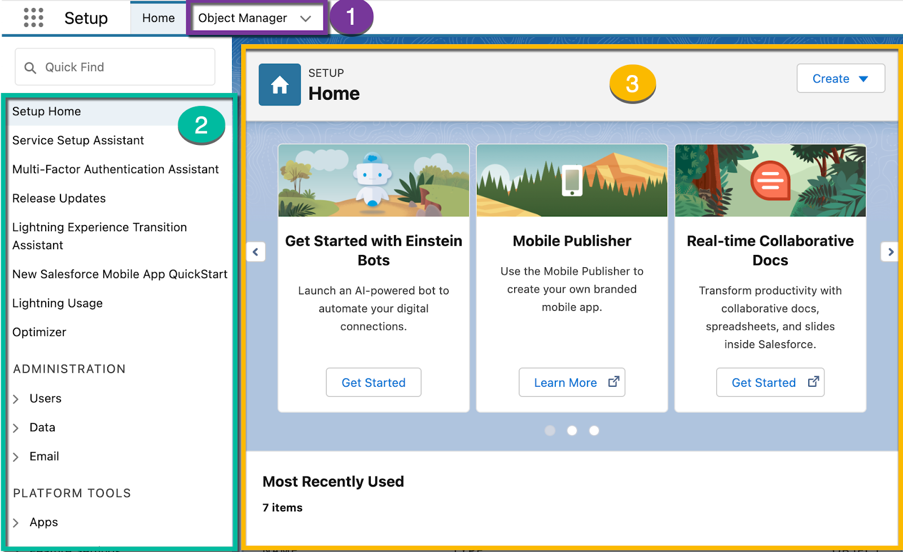

Salesforce admin [#]_
=====================

.. contents::
    :depth: 1
    :local:
    :backlinks: entry

Learn About the Salesforce Admin Role
-------------------------------------

Salesforce Administration is an operational role. Salesforce Admins solve business problems by customizing the Salesforce Platform. They build, configure, and automate techonology solutions to deliver business value. Core responsibilities include supporting users, managing data, maintaining security standards, and delivering actionable analytics.

Required Skills
...............

Communication:
  Collaborate with busines and technical stakeholders to design, configure, adn implement Salesforce.
Problem solving: 
  Solve business problems using the Salesforce Platform. Helps being ``detail-oriented`` and to have ``analytical skills``.
Security management: 
  Proactively set up processes to manage and protect customer and business data.
Data analysis:
  Provide reporting on a regular basis to help users and executives gain insights and make decisions from Salesforce data.
Designer's mindset:
  Create huma-centered user experiences in Salesforce.
Process automation:
  Create, maintain, and enhance automated business processes.
Project management:
  Plan and overse Salesforce projects to ensure they're completed on time and within budget.

Key Responibilites
..................

User Management:
  The Salesforce Admin serves as a subject matter expert for user and team needs. They desing a Salesforce solution that is customized and ensures a good user experience. Behind this is the goal to ``improve productivity`` and ``increase adoption``.

Data Management:
  Salesforce Admins use their expertise to ``ensure the data is high quality`` (no duplications), that the data can be reported on for key business decisions, and that ``users get the information they need easily``.

Security:
  The Salesforce Admin collaborates with the company's IT and security teams to ensure the Salesforce solution aligns with compliance needs and policies. The admin ensures Salesforce is configured so that users see only what they need to see.

Actionable Analytics:
  The Salesforce Admin takes building reports a step further by ensuring the reports and dashboards built for their company are ``easy to read`` an that users can ``make critical decisions based on the information they're seeing``.

Essential Habits for Salesforce Admins
--------------------------------------

`Create your own Calendar Habits Kit <https://org62.my.salesforce.com/sfc/p/#000000000062/a/3y000001UL0V/vMgMiOnP9L.5hI5AY544xrCLLyxbwt9Tp0_PYH.Ym3A>`_

1. User management
..................

- Observe your users (30 min per week).
- Review and report on adoption (60 min per week).

  - Perform user audits

- Communicate with stakeholders (60 min per month).
- Create and maintain a user guide (60 min per week).

  - Each function
  - Other admins
  - Descriptions, Help Text, and In-Apss Guidance

.. admonition:: Summary

  Gather information on ``MON`` or ``TUE``, study what we have and how well we are using it on ``WED`` or ``THU``, and on ``THU`` or ``FRI`` add documentation.

2. Data management
..................

- Create and maintain backup solution (30 min per month).

  - Weekly data export.

    - Include images, documents, attachments.

- Cleanse data (time estimation depends on the project).

  - Create a custom report type (object + DUPLICATES).
  - Workflow rules, process builder, flow.

- Review and refresh sandboxes (30 min per week).

  - Good idea to ensure the sandboxes are refreshed after each successful production deployment.
  - Do not refresh before talking to the sandbox's owner.

- Maintain and improve your org (time estimation depends on the project).

  - **Don't configure directly in production**.
  - Focus on the most important areas for your business.
  - Run Optimizer for an overview of where to begin.
  - Run Lightning Page Optimization for specific performance recommendations.

- Maintain your Data Dictionary (60 min per week).

  - Data type & attributes (length)
  - API name
  - Sample result
  - Business purpose
  - Integrations or Dependencies
  
  (Try the nonprofit starter pack `data dictionary template <sforce.co/NPSPDataDictionary>`_)

.. admonition:: Summary

  On ``MON`` or ``TUE`` solicit feedback and observe users. Design and configure solutions on ``WED`` or ``THU``, and communicate and deploy changes on ``THU`` or ``FRI``.

3. Security
...........

- Managing communication with partners and IT (60 min per week).

  - Compliance policies
  - User onboarding and off-boarding procedures
  - Updates to data structures for integrations (data dictionaries)
  - Sandbox provisioning
  - Automated scripts
  - Multifactor authentication

- Review access and visibility on users (60 min per week).

  - 4 layers controls access and visibility:

    .. hint::

      Compile access related notes each week and organize them according this 4 layers.

    1. Organization:

      .. hlist::

        - Single sign-on
        - Multi-factor authentication
        - Password policies
        - Certificate & key management

    2. Persona:
        
    .. hlist::

      - Profile
      - Permission sets
      - Permission set groups
      - IP restrictions & login hours

    3. Record:
        
    .. hlist::

      - OrgWide defaults
      - Sharing rules, sets & groups
      - Role hierarchy
      - Manual & programmatic sharing
      - Teams
      - Territories
        
    4. Field:

    .. hlist::

      - Field level security

- Run Health Check:

  - Measure your Org's security against Salesforce's standard baseline.
  - Easily identify at-risk security settings.
  - Fix with one click for immediate results.
  - Customize based on your company's compliance needs.

- Stay up to date on security features (learn continuously at leat 60 min per week):

  - Visit Salesforce security websites:

    * trust.salesforce.com/en/security
    * admin.salesforce.com/security

  - Subscribe to the Admin Digest.
  - Read latest release notes security section.
  - Activate security-focused release updates in Setup.

.. admonition:: Summary

  Deepening knowledge on security early on the week ``TUE``. Review access and visibility for users on ``WED``, and communicate with IT on ``FRI``.

----

- Salesfroce:

  - Provide solutions that enable the customer to keep their data secure.
  - Educate customers on the need for security and how to enable it.

- Admin:

  - Adopt evolving security controls and features.
  - Continually monitor user behaviors and event logs.
  - Protect sensitive data in alignment with compliance standards.

----

.. important::

  - Salesforce releases 3 updates each year.
  - Ensure users have the least level of access to the system and data necessary to perform their job functions.
  - Users have access to applications, objects, fields and pages their required.

4. Actionable analytics
.......................

Actionable analytics allow your company to drive business decisions by using your Salerfoce data.

- Conduct quarterly Business Review ``QBR`` (several hours per quarter).

  - Business reviews are meetings in which business leaders and individual contributors discuss business goals and the progress they've made so far.
  - You are there to listen and observe.
  - Take notes about complaints and wins, and how well your org is configured to assist in those plans.

- Confirm and update KPIs (1 hour per quarter).

- Review and update key reports and dashboards (few hours per quarter / after KPIs).

  - Document reporting changes and related business initiatives.
  - Explain changes to how KPIs are masured.
  - Share pain points that have been removed.
  - Communicate across multiple messaging channels.
  - Include a method to capture feedback and questions.

.. admonition:: Summary

  Quaterly Business Review ``MON``, confirm KPIs ``TUE`` and review reports and dashboards ``WED``. (Once a quarter)

Salesforce Platform Basics
--------------------------

APP: 
  A set of objects, fields, adn other functionality that supports a business process. (switch between apps using the APP Launcger a.k.a. the waffle).
Objects: 
  Tables in the Salesforce database that sotre a particular kind of information. There are ``standard objects`` like Accounts and Contacts and ``custom objects``.
Records:
  Rows in object database tables. Records are the actual data assotiated with an object.
Fields:
  Columns in object database tables.
Org: 
  A specific instance of Salesforce.

Trailhead Playground (TP)
.........................

A safe environment where you can practice the skills you're learning before you take them to your real work. You can have up to 10 at a time.

Customizing the Salesforce Platform
^^^^^^^^^^^^^^^^^^^^^^^^^^^^^^^^^^^

Developing without code is known as no-code (or declarative) development. With no-code development, you use forms and drag-and-drop tools to perform powerful customization tasks. The platfomr also offers ``programmatic development``, which uses things like Lightning components.

Every time you create a custom objecto, you automatically get something called ``Chatter`` feed tracking. As you start building with the platform, keep your eye out for process with:
  
- Heavy email collaboration
- Reliance on spreadsheets
- Shared local documents
- Time-intensive, repetitive manual steps
- Impact on only a few departments (you want to minimize the number of stakeholders while you're still learning)

Processes with these traits are great candidates for early projects on the Salesforce platform.

Understand the Salesforce Architecture
^^^^^^^^^^^^^^^^^^^^^^^^^^^^^^^^^^^^^^

* Salesforce is a cloud company. Everything we offer resides in the trusted, multitenant cloud.
* The Salesforce platform is the foundation of our services. It's powered by metadata and made up of different parts, like data services, artificial intelligence, and a robust APIs for development.
* All our apps sit on top of the platform. Our prebuilt offerings like Sales Cloud and Marketing Cloud, along with apps you build using the platform, have consistent, powerful functionality.
* Eveything is integrated. Our platform tehcnologies like predictive analytics and the development framework are built into everything we offer and everything you build.

Trust
~~~~~

In the `trust site <trust.salesforce.com>`_ you can view performance data and get more information about how we secure your data. It also shows you any planned maintenance we'll be performing that might impact your access to Salesforce. It is Salesforce's website to provide transparency around service availability, performance, security, privacy, and compliance. Trust status gives you a quick and easy way to see if yoyur org performance has been affected so you can let your users know of any changes.

Multitenancy
~~~~~~~~~~~~

Salesforce provides a core set of services to all out customers in the multitenant cloud. No matter the size of your business, you get access to the same computing power, data storage, and core features (multitenancy = shared resources). With this, you never have to install new features or worry about your hardware.

Metadata
~~~~~~~~

Data about data, custom configurations, functionality, and code in your org are metadata. Part of the reason you can move so fast on the platform is that Salesforce knows how to store and serve you that metadata immediately after you create it.

Application Programming Interface (a.k.a. API)
~~~~~~~~~~~~~~~~~~~~~~~~~~~~~~~~~~~~~~~~~~~~~~

The Salesforce API is like a contract between two pieces of software, allowing them to connect and exchange information. When you add a custom object or field, the platform automatically creates an API name that serves as an access point between your org and the database. Salesforce uses that API name to retrieve the metadata and data you're looking for.

The core of the API's power is that all your data and metadata is API enabled. Every time you use Salesforce, whether you're using standard functionality or building a custom app, you're interacting with the API.

Navigate Setup
^^^^^^^^^^^^^^

  From the gear menu at the top of the screen, click :strong:`Setup`.

  +-------------------+-----------------------------------------------+
  | 1. Object Manager | Customize standard and custom objects.        |
  +-------------------+-----------------------------------------------+
  | 2. Setup Menu     | Quick links to a collection of pages.         |
  +-------------------+-----------------------------------------------+
  | 3. Main Window    | Displaying area.                              |
  +-------------------+-----------------------------------------------+

There are 3 main categories in the Setup menu:

* :strong:`Administration`: where you can manage your users and data (add users, change permissions, import and export data, and create email templates). 
* :strong:`Platform Tools`: You do most of your customization in Platform Tools. You can view and manage your data model, create apps, modify the user interface, and deploy new features to your users. Also is where you can manahe your code when using programmatic development.
* :strong:`Settings`: manage your company information and org security (add business hours, change your locale, and view your org's history).

Power Up with AppExchange
^^^^^^^^^^^^^^^^^^^^^^^^^

Salesforce has a community of partners that use the flexibility of the Salesforce platform to build amazing apps and other solutions that anyone can use. These offerings are available for installation on AppExchange.

Strategies for Success:
~~~~~~~~~~~~~~~~~~~~~~~

A solid AppExcanche strategy helps ensure that you're getting the highest value apps without duplicating functionality or investing in something that you don't need.

Follow these steps to develop a good AppExchange strategy:

1. Identify departments that use or plan to use Salesforce. These are your primary stakeholders.
2. Research what's available on AppExchange that best meets your stakeholder requirements. Discuss business cases with department heads to determine exact needs. Questions you may ask:
  
   a) What business problem are you trying to solve?
   b) What are your main pain points right now?
   c) How many users need this app?
   d) What's your budget?
   e) What's your timeline?

3. When you find an app tht you think meets your needs, download the app in a test environment (like a free Developer Edition or sandbox). Ensure that the app you're installing doesn't interfere with any other apps you've installed or customizations you've made.
4. If you're choosing between multiple apps, take some time toevaluate what you've tested. Determine whether ther are feature gaps or unwanted funtionality. Make demos.
5. Install and deploy in production environment. Make sure you keep your users in the loop about whats changing, and provide training and documentation as necessary.

  :emphasis:`Word of the wise: testing the app first helps you avoid conflicts in production with things like object names.`

Where'd My App Go?
~~~~~~~~~~~~~~~~~~

Apps are installed using somethind called a package. To find the package:

1. From Setup, you search and select Installed Packages in the Quick Find box.
2. Click the name of the package you installed. It will be the same name from the AppExchange download page.
3. Click :strong:`View Components` to see more information about the package. The Package Details page shows you all the components, including custom fields, and Apex classes in the package. This information helps you determine whether you have any conflicts in your own customization.

  :emphasis:`Be sure to check out free apps provided by Salesforce Labs. The great thing about Salesforce Labs apps is that they're open source. You can customize them as needed and peek under the hood to see how they work.`

User Management
---------------

Add New Users
^^^^^^^^^^^^^

A user is anyone who logs in to Salesforce who need access to the company's records. Every user in Salesforce has a user account. The user account identifies the user, and the user account settings determine what features and records the user caan access. Each user account contain at least a ``user name``, ``email address``, ``user's first and last name``, ``alias``, ``nick name``, ``license``, ``profile`` and a ``role``.

Usernames
    Each user name has both a username and formatted like an email address which can or cannot be real as long as it is unique across all Salesforce organizations. When a user is added the user's password must be changed the first time they log in.
User Licenses
    A user license determines which feactures the user can access in Salesforce.
Profiles
    Profiles detemine what users can do in Salesforce. They come with a sert of permissions which grant access to particular objects, fields, tabs, and records.
Roles
    Roles determine qhat users can see in Salesforce based on where they are located in the role hierarchy. Users at the top of the hierarchy can see all the data owned by userds below them. Users at a lower level can see data owned by users above them only if sharing rules grant them access.
Alias
    An alias is a short name to identify the user on list pages, reports or other places where their entire name doesn't fit.

To add users:

1. From Setup select :strong:`Users`.
2. Click :strong:`New User` or :strong:`Add Multiple Users` to add up to 10 users at a time.
3. Enter each user's information.
4. Select the user license.
5. Select a profile.
6. Select :strong:`Generate passwords and notify user via email`.
7. Save.

You can perform essesntial admin tasks like resetting passwords, freezin users, and viewing current system status from your mobile device.

Glossary
--------

.. glossary::
  
  Add custom field to std object
    :menuselection:`Setud --> Object Manager --> Object --> Details panel: Fields & Relationships --> New`

  Use :term:`Add custom field to std object`

.. [#] `Build Your Admin Career on Salesforce <https://trailhead.salesforce.com/es-MX/users/strailhead/trailmixes/build-your-admin-career-on-salesforce>`_
